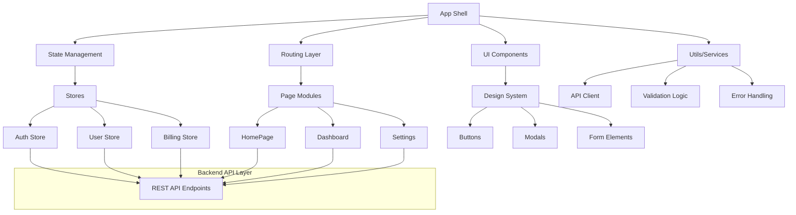

# SaaS Multi-Tenancy Architecture to Enterprise Scale

A complete reference architecture for building a modern, scalable, and secure SaaS platform. Designed for rapid development, real-time features, multi-tenancy, and full enterprise scalability.


## Project Contents

- **MkDocs Documentation** — Full architectural strategy
- **Helm Charts** — Kubernetes deployment (example: `api-gateway`)
- **Terraform Scripts** — Basic AWS infra setup
- **Diagrams** — JWT payload, GitOps flow, and more
- **Docker Setup** — Complete local development environment

## Tech Stack

| Layer                  | Tech                             |
|------------------------|----------------------------------|
| Frontend               | React, Tailwind, Material UI     |
| Mobile                 | Expo, React Native               |
| Backend                | NestJS (TypeScript), gRPC, REST  |
| API Gateway            | NestJS + Auth Middleware         |
| Realtime               | WebSocket Gateway + Redis PubSub |
| Async Communication    | Redis Streams, NATS, Kafka       |
| Authentication         | Clerk.dev, FusionAuth, Keycloak  |
| Authorization          | JWT, RBAC, ABAC, OPA             |
| Billing                | Stripe Subscriptions             |
| Infrastructure as Code | Terraform, Helm, ArgoCD          |
| CI/CD                  | GitHub Actions                   |
| Observability          | Prometheus, Grafana, OpenTelemetry |
| Documentation          | MkDocs, Mermaid, JsonCrack       |

## Architectural Reference


## Local Development with Docker
### Prerequisites

- Docker Engine 24.0.0 or later
- Docker Compose v2.20.0 or later
- At least 16GB RAM recommended
- Support for both AMD64 and ARM64 architectures

### Directory Structure

```
.
├── site/
│   └── frontend/         # React frontend code
├── services/
│   └── api-gateway/     # NestJS API gateway code
├── config/
│   ├── prometheus/      # Prometheus configuration
│   └── otel-collector/  # OpenTelemetry configuration
├── docs/                # MkDocs documentation
├── Dockerfile.backend   # Multi-arch NestJS Dockerfile
├── Dockerfile.frontend  # Multi-arch React Dockerfile
├── nginx.conf          # Nginx configuration for frontend
└── docker-compose.yml  # Local development orchestration
```

### Available Services

| Service               | Local URL                    | Description                           |
|----------------------|------------------------------|---------------------------------------|
| Frontend             | http://localhost:3000        | React SPA with hot-reload            |
| API Gateway          | http://localhost:4000        | NestJS API Gateway                   |
| Documentation        | http://localhost:8000        | Live MkDocs documentation            |
| Keycloak            | http://localhost:8080        | Authentication & Authorization        |
| Grafana             | http://localhost:3001        | Metrics & Dashboards                 |
| Prometheus          | http://localhost:9090        | Metrics Storage                      |
| PostgreSQL          | localhost:5432               | Main Database                        |
| Redis               | localhost:6379               | Caching & Pub/Sub                    |
| NATS                | localhost:4222               | Message Queue                        |
| Kafka               | localhost:9092               | Event Streaming                      |
| OpenTelemetry       | localhost:4317 (gRPC)        | Distributed Tracing                  |

### Quick Start

1. Clone the repository:
```bash
git clone https://github.com/your-org/saas-architecture.git
cd saas-architecture
```

2. Start the development environment:
```bash
# Start all services
docker compose up --build

# Start specific services
docker compose up frontend api-gateway postgres
```

3. Access the services:
- Frontend application: http://localhost:3000
- API Documentation: http://localhost:4000/api
- Project Documentation: http://localhost:8000
- Keycloak Admin: http://localhost:8080/admin (admin/admin)
- Grafana Dashboards: http://localhost:3001 (admin/admin)

### Development Features

- **Hot Reload**: Frontend and backend code changes are reflected immediately
- **Multi-arch Support**: Works on both Intel/AMD and Apple Silicon machines
- **Unified Logging**: All service logs available through Docker Compose
- **Debugging**: Exposed ports for attaching debuggers
- **Metrics & Tracing**: Complete observability stack with Prometheus, Grafana, and OpenTelemetry

### Common Tasks

```bash
# View service logs
docker compose logs -f api-gateway

# Rebuild a specific service
docker compose up -d --build frontend

# Reset all data
docker compose down -v

# Scale services
docker compose up -d --scale api-gateway=2
```

## Production Deployment

For production deployment instructions, see:
- Kubernetes deployment: [helm-charts/README.md](helm-charts/README.md)
- AWS infrastructure: [terraform/aws/README.md](terraform/aws/README.md)

### Documentation: https://eooo-io.github.io/sass-architecture/

---

