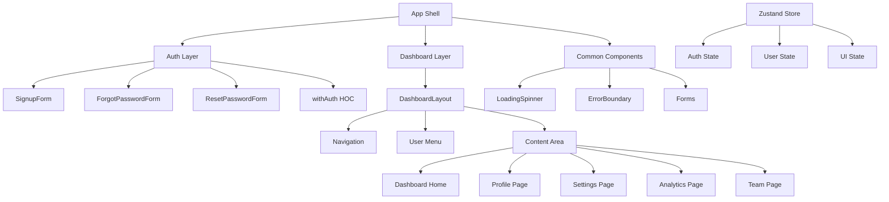

# SaaS Multi-Tenancy Architecture to Enterprise Scale

A complete reference architecture for building a modern, scalable, and secure SaaS platform. Designed for rapid development, real-time features, multi-tenancy, and full enterprise scalability.


## Project Contents

- **Frontend Implementation**
  - Complete authentication flow (signup, password reset)
  - Dashboard with analytics and team management
  - Responsive layouts and modern UI components
  - TypeScript + Next.js + Tailwind CSS
- **MkDocs Documentation** — Full architectural strategy
- **Helm Charts** — Kubernetes deployment (example: `api-gateway`)
- **Terraform Scripts** — Basic AWS infra setup
- **Diagrams** — JWT payload, GitOps flow, and more
- **Docker Setup** — Complete local development environment

## Tech Stack

| Layer                  | Tech                             | Implementation Status |
|-----------------------|----------------------------------|---------------------|
| Frontend              | Next.js, TypeScript, Tailwind    | ✅ Authentication, Dashboard |
| Mobile               | Expo, React Native               | 🚧 Planned |
| Backend              | NestJS (TypeScript), gRPC, REST  | 🚧 In Progress |
| API Gateway          | NestJS + Auth Middleware         | 🚧 In Progress |
| Realtime             | WebSocket Gateway + Redis PubSub | 🚧 Planned |
| Async Communication  | Redis Streams, NATS, Kafka       | 🚧 Planned |
| Authentication       | Clerk.dev, FusionAuth, Keycloak  | ✅ Frontend Flow |
| Authorization        | JWT, RBAC, ABAC, OPA             | ✅ Route Protection |
| Billing              | Stripe Subscriptions             | 🚧 Planned |
| Infrastructure as Code| Terraform, Helm, ArgoCD          | 🚧 Base Setup |
| CI/CD                | GitHub Actions                   | 🚧 Planned |
| Observability        | Prometheus, Grafana, OpenTelemetry| 🚧 Planned |
| Documentation        | MkDocs, Mermaid, JsonCrack       | ✅ Initial Setup |

## Frontend Features

### Authentication & Authorization
- Complete signup flow with company registration
- Password reset functionality
- Protected route middleware
- Auth state management with Zustand
- HOC-based route protection

### Dashboard Implementation
- Responsive dashboard layout
- Stats cards and activity feed
- User profile management
- Team management with invite system
- Analytics and metrics visualization
- Settings and preferences

### Component Architecture


## Architectural Reference


## Local Development with Docker
### Prerequisites

- Docker Engine 24.0.0 or later
- Docker Compose v2.20.0 or later
- At least 16GB RAM recommended
- Support for both AMD64 and ARM64 architectures

### Directory Structure

```
.
├── site/
│   └── frontend/         # React frontend code
├── services/
│   └── api-gateway/     # NestJS API gateway code
├── config/
│   ├── prometheus/      # Prometheus configuration
│   └── otel-collector/  # OpenTelemetry configuration
├── docs/                # MkDocs documentation
├── Dockerfile.backend   # Multi-arch NestJS Dockerfile
├── Dockerfile.frontend  # Multi-arch React Dockerfile
├── nginx.conf          # Nginx configuration for frontend
└── docker-compose.yml  # Local development orchestration
```

### Available Services

| Service               | Local URL                    | Description                           |
|----------------------|------------------------------|---------------------------------------|
| Frontend             | http://localhost:3000        | React SPA with hot-reload            |
| API Gateway          | http://localhost:4000        | NestJS API Gateway                   |
| Documentation        | http://localhost:8000        | Live MkDocs documentation            |
| Keycloak            | http://localhost:8080        | Authentication & Authorization        |
| Grafana             | http://localhost:3001        | Metrics & Dashboards                 |
| Prometheus          | http://localhost:9090        | Metrics Storage                      |
| PostgreSQL          | localhost:5432               | Main Database                        |
| Redis               | localhost:6379               | Caching & Pub/Sub                    |
| NATS                | localhost:4222               | Message Queue                        |
| Kafka               | localhost:9092               | Event Streaming                      |
| OpenTelemetry       | localhost:4317 (gRPC)        | Distributed Tracing                  |

### Quick Start

1. Clone the repository:
```bash
git clone https://github.com/your-org/saas-architecture.git
cd saas-architecture
```

2. Start the development environment:
```bash
# Start all services
docker compose up --build

# Start specific services
docker compose up frontend api-gateway postgres
```

3. Access the services:
- Frontend application: http://localhost:3000
- API Documentation: http://localhost:4000/api
- Project Documentation: http://localhost:8000
- Keycloak Admin: http://localhost:8080/admin (admin/admin)
- Grafana Dashboards: http://localhost:3001 (admin/admin)

### Development Features

- **Hot Reload**: Frontend and backend code changes are reflected immediately
- **Multi-arch Support**: Works on both Intel/AMD and Apple Silicon machines
- **Unified Logging**: All service logs available through Docker Compose
- **Debugging**: Exposed ports for attaching debuggers
- **Metrics & Tracing**: Complete observability stack with Prometheus, Grafana, and OpenTelemetry

### Common Tasks

```bash
# View service logs
docker compose logs -f api-gateway

# Rebuild a specific service
docker compose up -d --build frontend

# Reset all data
docker compose down -v

# Scale services
docker compose up -d --scale api-gateway=2
```

## Production Deployment

For production deployment instructions, see:
- Kubernetes deployment: [helm-charts/README.md](helm-charts/README.md)
- AWS infrastructure: [terraform/aws/README.md](terraform/aws/README.md)

### Documentation: https://eooo-io.github.io/sass-architecture/

---

